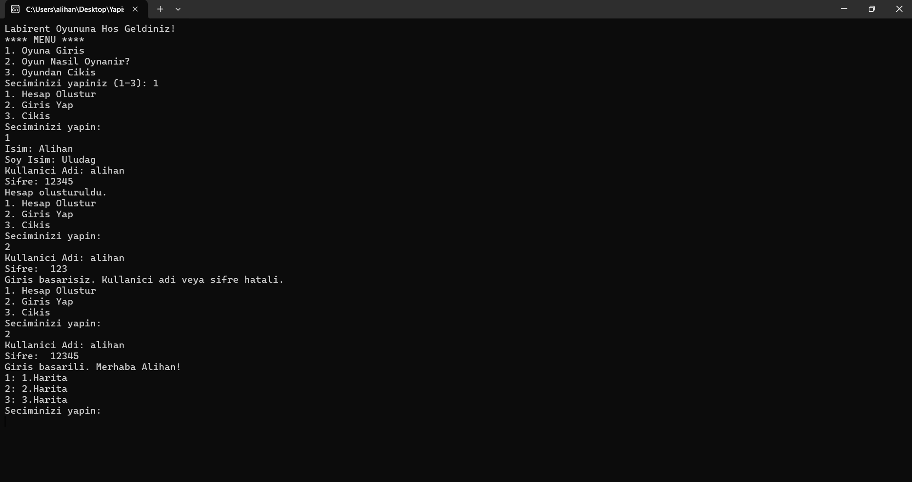
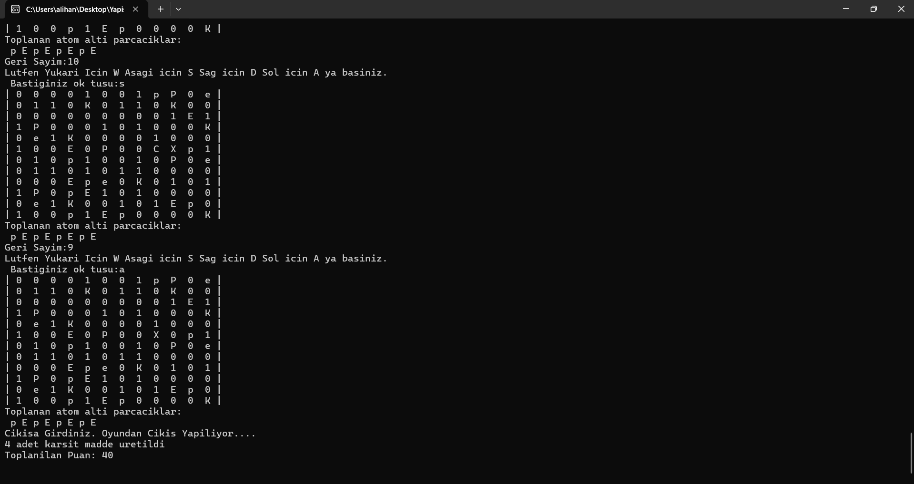

# Karşıt Madde Labirenti

## Proje Tanımı

"Karşıt Madde Labirenti", bir labirent matrisinde kullanıcıların atomaltı parçacıklar toplayarak çıkış noktasına ulaşmaya çalıştığı bir metin tabanlı oyundur. Oyuncular, belirli kurallar çerçevesinde labirentte hareket ederek karşıt hidrojen üretmek için gerekli parçacıkları toplamalıdır.

## Özellikler

- **Labirent Yapısı**: Labirent, `N x M` boyutunda bir matris ile temsil edilmektedir.
- **Atomaltı Parçacıklar**: Labirentte p, E, P, e gibi parçacıklar bulunur.
- **Karşıt Hidrojen Üretimi**: Çıkışa ulaşırken sadece p ve E parçacıkları toplanmalıdır.
- **Kullanıcı Girişi**: Oyuncular, hesap oluşturma ve giriş yapma işlemlerini gerçekleştirebilir.
- **Harita Seçimi**: Hazır haritalardan biri seçilebilir.
- **Ekran Güncellemeleri**: Kullanıcı her hareket ettiğinde labirent ve toplanan parçacıklar güncellenir.
- **Hareket Kontrolleri**: WASD tuşları ile labirentte hareket edilir; geçersiz hareketlerde uyarılar yapılır.
- **Oyun Sonu**: Karadeliklere düşüldüğünde veya süre dolduğunda oyun sona erer.

## Kullanılan Teknolojiler

- **C Programlama Dili**
- **Struct ve Pointer Yapıları**
- **Memory Allocation**
- **Dosya Yazma ve Okuma**

## Kurulum ve Çalıştırma

1. Gerekli bir C derleyicisi kurulu olduğundan emin olun (örn. `gcc`).
2. Kaynak kodunu klonlayın veya indirin.

## Screenshots

